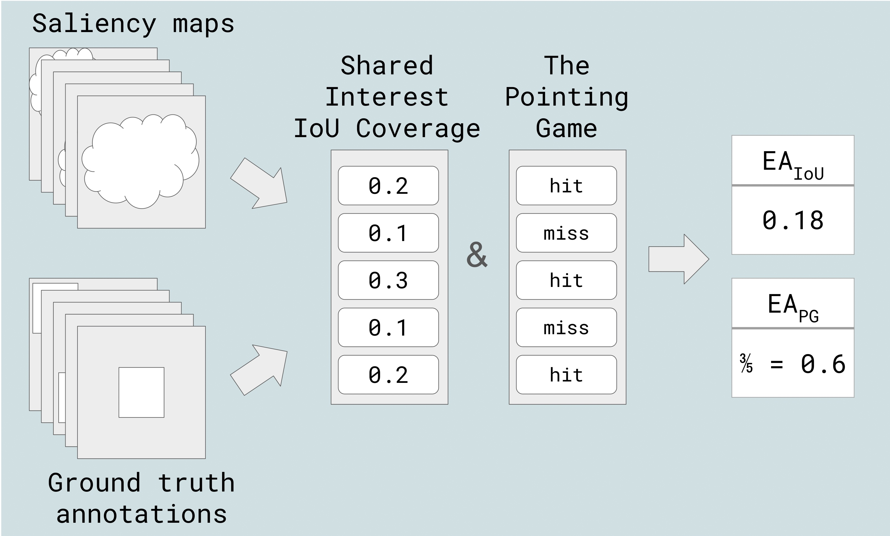
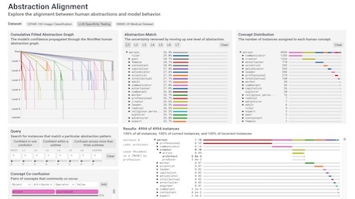

  

    
    

      <a href="{{ '/CV.pdf' | relative_url }}" target="_blank" aria-label="CV" class="cv-link">CV</a>
      <a href="https://www.linkedin.com/in/hyeminbang" target="_blank" aria-label="LinkedIn">
        <svg xmlns="http://www.w3.org/2000/svg" width="24" height="24" viewBox="0 0 24 24" fill="#0077b5"><path d="M19 0h-14c-2.761 0-5 2.239-5 5v14c0 2.761 2.239 5 5 5h14c2.762 0 5-2.239 5-5v-14c0-2.761-2.238-5-5-5zm-11 19h-3v-11h3v11zm-1.5-12.268c-.966 0-1.75-.79-1.75-1.764s.784-1.764 1.75-1.764 1.75.79 1.75 1.764-.783 1.764-1.75 1.764zm13.5 12.268h-3v-5.604c0-3.368-4-3.113-4 0v5.604h-3v-11h3v1.765c1.396-2.586 7-2.777 7 2.476v6.759z"/></svg>
      </a>
      <a href="mailto:hbang@mit.edu" aria-label="Email">
        <svg xmlns="http://www.w3.org/2000/svg" width="24" height="24" viewBox="0 0 24 24" fill="#666"><path d="M0 3v18h24v-18h-24zm21.518 2l-9.518 7.713-9.518-7.713h19.036zm-19.518 14v-11.817l10 8.104 10-8.104v11.817h-20z"/></svg>
      </a>
    

  

  <h1>Hyemin Bang</h1>
  <h2 class="subtitle">MIT PhD student studying HCI + AI</h2>

  
Hi! I'm Hyemin (Helen)! I'm a PhD student at MIT CSAIL advised by <a href='https://mitchellg.github.io'>Mitchell Gordon</a>. My research focuses on improving human-AI interaction by creating more intuitive and transparent AI systems that empower people to collaborate effectively with AI.

  
Previously, I received my SB and MEng in computer science from MIT, where I worked with <a href='https://arvindsatya.com'>Arvind Satyanarayan</a> in the <a href='http://vis.mit.edu/'>Visualization Group</a>.

## Recent News

  

    
Sep 2025

    
Started my PhD at MIT CSAIL.

  

  

    
May 2025

    
Graduated with MEng in Computer Science (concentration in Artificial Intelligence) from MIT.

  

  

    
Oct 2024

    
Presented Explanation Alignment at ECCV Workshop on Explainable Computer Vision in Milan, Italy.

  

## Recent Work

  

    

      
    

    

      
Explanation Alignment: Quantifying the Correctness of Model Reasoning At Scale

      
<b>Hyemin Bang</b>, Angie Boggust, Arvind Satyanarayan

      
ECCV Workshop on Explainable Computer Vision 2024

      

        <a href="https://vis.csail.mit.edu/pubs/explanation-alignment/">Project</a>
        <a href="https://vis.csail.mit.edu/pubs/explanation-alignment.pdf">Paper</a>
        <a href="https://github.com/mitvis/explanation_alignment">Code</a>
      

    

  

  

    

      
    

    

      
Abstraction Alignment: Comparing Model-Learned and Human-Encoded Conceptual Relationships

      
Angie Boggust, <b>Hyemin Bang</b>, Arvind Satyanarayan

      
CHI 2025

      

        <a href="https://vis.csail.mit.edu/pubs/abstraction-alignment/">Project</a>
        <a href="https://vis.csail.mit.edu/pubs/abstraction-alignment.pdf">Paper</a>
        <a href="https://github.com/mitvis/abstraction-alignment">Code</a>
      

    

  

